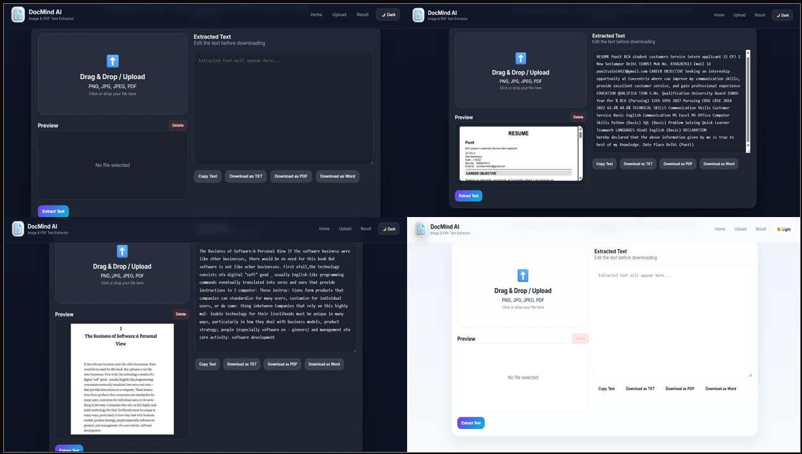

# OCR Text Extraction System

## Overview
This project is an OCR (Optical Character Recognition) application that extracts text from images and PDF files. Users can upload a file, extract text, edit it, and download the extracted text.

## Features
- Image Upload
- PDF Upload
- Text Extraction using OCR
- Editable Extracted Text
- Download as TXT
- User-Friendly Interface

## Technologies Used
- Python
- Flask
- OpenCV
- EasyOCR
- HTML
- CSS
- JavaScript
- MySQL

python -m venv .venv
.venv\Scripts\Activate
pip install -r requirements.txt
pip freeze > requirements.txt
python app.py

## Project Screenshot

